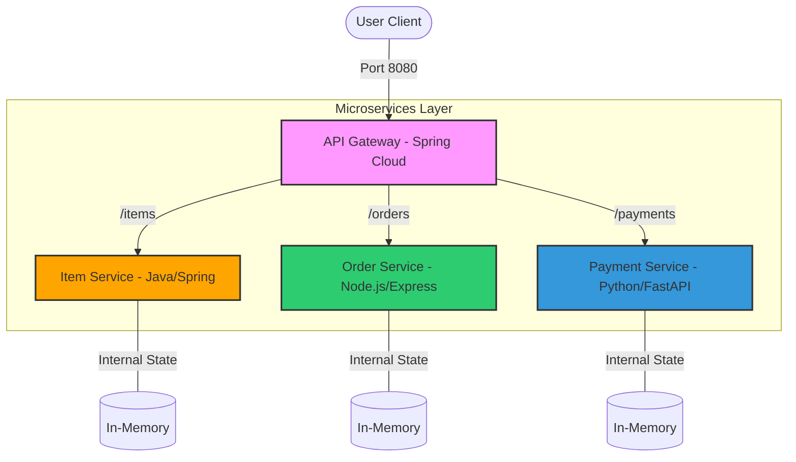

# CTSE-Lab05: Polyglot Microservices System

[](https://www.docker.com/)
[](https://www.oracle.com/java/)
[](https://nodejs.org/)
[](https://www.python.org/)
[](https://opensource.org/licenses/MIT)

A robust, polyglot microservices ecosystem designed for the **Current Trends in Software Engineering (SE4010)** lab. This project demonstrates service-to-service communication, API gateway routing, and container orchestration using Java, Node.js, and Python.

---

## 🏗️ System Architecture

The architecture follows a modular approach where each service is built with a different technology stack, communicating through a unified **Spring Cloud Gateway**.



---

## 🛠️ Technology Stack

| Service | Technology | Port | Description |
| :--- | :--- | :--- | :--- |
| **API Gateway** | Spring Cloud Gateway | `8080` | Central entry point and request router. |
| **Item Service** | Java 17 + Spring Boot | `8081` | Manages product inventory and item details. |
| **Order Service** | Node.js + Express | `8082` | Handles order creation and tracking. |
| **Payment Service** | Python 3.9 + FastAPI | `8083` | Processes transactions and payment logs. |

---

## 🚀 Getting Started

### Prerequisites
- [Docker Desktop](https://www.docker.com/products/docker-desktop/) installed and running.
- [Docker Compose](https://docs.docker.com/compose/install/) (v2.0+ recommended).

### Deployment
1. **Clone the repository:**
   ```bash
   git clone https://github.com/IsaraSE/CTSE-Lab05.git
   cd CTSE-Lab05
   ```

2. **Build and Run:**
   ```bash
   docker-compose up --build
   ```

3. **Verify Health:**
   Check if services are alive via the Gateway:
   - `GET http://localhost:8080/items/health`
   - `GET http://localhost:8080/orders/health`
   - `GET http://localhost:8080/payments/health`

---

## 📖 API Documentation

### 1. Item Service (`/items`)
- **GET `/items`**: List all available items.
- **POST `/items`**: Add a new item.
  - Body: `{"name": "Smartphone"}`
- **GET `/items/{id}`**: Retrieve specific item.

### 2. Order Service (`/orders`)
- **GET `/orders`**: View all orders.
- **POST `/orders`**: Place a new order.
  - Body: `{"item": "Laptop", "quantity": 2}`
- **GET `/orders/{id}`**: Get order status.

### 3. Payment Service (`/payments`)
- **GET `/payments`**: List all payment records.
- **POST `/payments/process`**: Process a new payment.
  - Body: `{"orderId": 1, "amount": 150.0, "method": "CREDIT_CARD"}`

---

## 📁 Project Structure

```text
.
├── api-gateway/         # Spring Cloud Gateway configuration
├── item-service/        # Java Spring Boot - Item management
│   └── src/main/java/   # Source code with SLF4J logging
├── order-service/       # Node.js Express - Order processing
├── payment-service/     # Python FastAPI - Payment gateway
├── docker-compose.yml   # Multi-container orchestration
└── README.md            # Comprehensive documentation
```

---

## 🎓 Lab Submission Details

- **Course**: Current Trends in Software Engineering (SE4010)
- **Lab Number**: 05
- **Focus**: Polyglot Architecture & Containerization
- **Student ID**: IT22154880

---

<p align="center">
  Developed with ❤️ for the CTSE Lab
</p>
